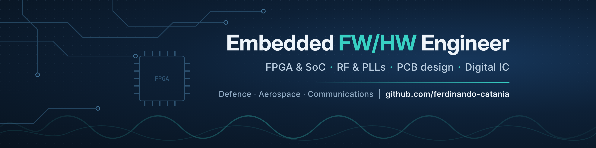

## Hi, I'm Ferdinando 👋

**Embedded Firmware & Hardware Engineer** working on high-reliability electronics for defence, aerospace and communications: FPGA/SoC boards, RF front-ends, system integration and test.
Background in **electronic and biomedical engineering** (University of Naples Federico II, Forschungszentrum Jülich, Erasmus in Coimbra and Reykjavík), and **co-founder of [Stabiae Tour](https://stabiaetour.com)**, a small tourism business I run largely with code and AI agents.

### 🔧 What I do

- **FPGA & SoC**: VHDL/SystemVerilog, Xilinx Vivado/Vitis, Zynq-7000, AXI4-Lite, SPI/I²C peripherals
- **Digital IC design**: RTL-to-layout flow (synthesis, P&R, CTS, STA, power) on standard-cell libraries
- **Hardware**: schematic & PCB design, RF/PLL configuration, analog front-ends, lab validation (oscilloscope, spectrum analyser)
- **System integration & test**: LAN, RS-422/485, MIL-STD-1553, ICD compliance, test reports
- **Signal processing**: MATLAB/Simulink for biosignals, imaging, identification and control

### 📂 Selected projects

| Project | Area | Stack |
| --- | --- | --- |
| [**zynq-spi-pll-control**](https://github.com/ferdinando-catania/zynq-spi-pll-control) | Zynq-7000 programs a TI LMX2820 PLL over SPI (2/4 GHz), validated on the bench | Vivado · AXI4-Lite · bare-metal C · XDC |
| [**asic-spike-detector**](https://github.com/ferdinando-catania/asic-spike-detector) | Spike-detector ASIC, IIR + emphasis + FSM, RTL → layout in 45 nm | SystemVerilog · synthesis · P&R · STA |
| [**biomedical-signal-generator-pcb**](https://github.com/ferdinando-catania/biomedical-signal-generator-pcb) | Portable biosignal generator: STM32 + 12-bit DAC, LCD, BLE, SD | Autodesk EAGLE · LTspice · Gerbers |
| [**arduino-heart-rate**](https://github.com/ferdinando-catania/arduino-heart-rate) | Heart rate from PPG (real time) vs ECG (offline) | Arduino C++ · MATLAB |
| [**stm32-smart-locker**](https://github.com/ferdinando-catania/stm32-smart-locker) | PIN-protected smart locker, STMicroelectronics summer campus | STM32 · ChibiOS |
| [**brain-tumor-mri-segmentation**](https://github.com/ferdinando-catania/brain-tumor-mri-segmentation) | Glioblastoma segmentation in MRI with Dice validation and GUI | MATLAB · App Designer |
| [**activity-recognition-and-system-identification**](https://github.com/ferdinando-catania/activity-recognition-and-system-identification) | Smartphone IMU activity analysis; ARX identification and deadbeat control | MATLAB · Simulink |
| [**optoelectronic-instrumentation**](https://github.com/ferdinando-catania/optoelectronic-instrumentation) | Low-cost urine-fluorescence cancer screening instrument; laser & fibre labs | Optoelectronics |
| [**high-voltage-engineering**](https://github.com/ferdinando-catania/high-voltage-engineering) | Finite-difference E-field simulation of a gas-insulated line; HV cable design | MATLAB |
| [**deep-brain-stimulation-parkinson**](https://github.com/ferdinando-catania/deep-brain-stimulation-parkinson) | Review of DBS systems for Parkinsonian tremor | Neuroengineering |
| [**startup-evaluation-and-project-management**](https://github.com/ferdinando-catania/startup-evaluation-and-project-management) | Venture evaluation, pitch, agile charter, project governance | Business |

### 🧭 Path

- **2025 – today** · Embedded FW/HW Engineer, D&P Electronic Systems (Frascati) — FPGA-based boards for radar, sonar and RF/IF processing
- **2023 – 2025** · System Integrator, Defence Tech Holding (Rome) — missile launch systems, interface debugging and validation
- **2024 – today** · M.Sc. Electronic Engineering, University of Naples Federico II
- **2022 – 2023** · Master's thesis at **Forschungszentrum Jülich** (Germany) — on-chip micro-electrodes and an electrochemical sensor for COVID-19 detection
- **2022** · 5G Academy, Federico II with TIM and Fastweb — 5G/IoT, drones for emergency rescue
- **2020 – 2023** · M.Sc. Biomedical Engineering (medical devices), Federico II · Erasmus at **Univ. of Coimbra** (2020) and **Reykjavík University** (2021)
- **2016 – 2020** · B.Sc. Biomedical Engineering, Federico II — thesis on EEG-based arousal measurement

### 🚀 Side project: Stabiae Tour

Walking tours, boat tours and excursions in Castellammare di Stabia and the Sorrento Coast, with a stack I built myself: static multilingual website, Cloudflare Pages Functions with Stripe checkout and webhooks, GitHub Actions, and AI agents (Claude) for content, bookings and consistency across booking platforms.

### 🛠️ Toolbox

           

### 📫 Contact

[LinkedIn](https://www.linkedin.com/in/ferdinandocatania) · [stabiaetour.com](https://stabiaetour.com)
